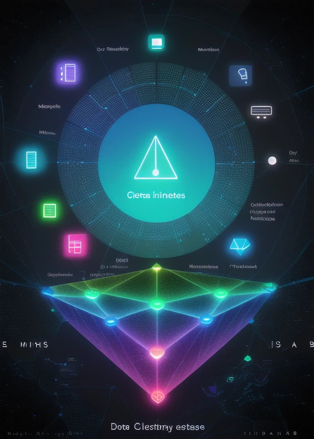
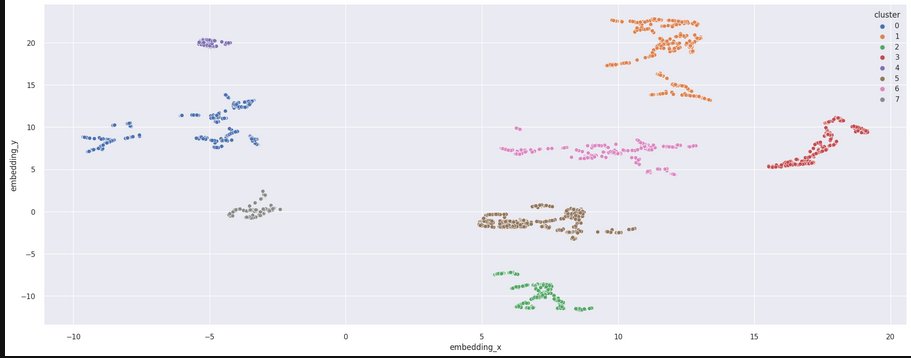
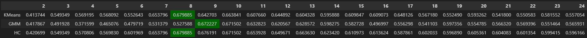
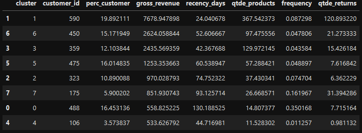

# Projeto Insiders - Ciclo 1

## 1. Descrição do Problema de Negócio
O projeto **Insiders** visa desenvolver um programa de fidelidade para uma empresa de outlet de multimarcas via e-commerce. O objetivo é identificar os clientes mais valiosos e criar estratégias para aumentar sua retenção e engajamento.

## 2. Estratégia de Solução Adotada

Para solucionar o problema, adotamos a seguinte estratégia:
1. **Análise Exploratória de Dados (EDA)**: 
   - Análise univariada e bivariada dos dados.
   - Tratamento de valores ausentes e outliers.

2. **Clusterização de Clientes**: 
- Aplicação de técnicas de clusterização para segmentar os clientes.
            
- Comparação de diferentes algoritmos de clusterização (K-Means, GMM, HC, DBSCAN).
            

3. **Visualização dos Resultados**:
   - Criação de gráficos e dashboards para interpretar os resultados [Metabase](https://www.metabase.com).

## 3. Data Set Utilizado
Os dados utilizados são provenientes de um desafio do Kaggle sobre e-commerce. O dataset pode ser encontrado no seguinte endereço:
[Kaggle E-commerce Dataset](https://www.kaggle.com/datasets/carrie1/ecommerce-data ).

## 4. TOP 6 Insights do Projeto
1. **GMV Concentrado**: 56.83% do GMV é gerado pelos clientes Insiders.
         
2. **Valor Médio de Compra**: Clientes com ticket médio alto têm maior probabilidade de se tornarem Insiders, o que justifica estratégias de upselling.
3. **Frequência de Compras**: Clientes que compram frequentemente tendem a ser mais leais, justificando esforços em programas de fidelidade para aumentar a frequência de compras.
4. **Retornos**: Clientes do grupo Insiders tem uma média de devolução alta, sugerindo a necessidade de estratégias para reduzir as devoluções.
5. **Dsitribuição do GMV**: A maior densidade de clientes Insiders está no intervalo de GMV entre €2.000 e €6.000, com a concentração de GMV mais próxima do terceiro quartil (75º percentil).
6. **Mediana do Faturamento**: A mediana do faturamento dos Insiders é 236,88% maior do que a mediana geral, mostrando que esses clientes geram receitas significativamente maiores.

## 5. Modelos de Machine Learning, Ferramentas e Bibliotecas Utilizadas
- **Modelos de Machine Learning**: K-means, GMM, HC, DB Scam.
- **Ferramentas**: Jupyter Notebook.
- **Bibliotecas**: 
  - Pandas
  - NumPy
  - Scikit-learn
  - Matplotlib
  - Seaborn

## 6. Escolha e Performance do Modelo Final
Foi escolhido o algoritmo de K-Means com 8 clusters como hiperparâmetro final. A escolha desse número de clusters se baseia na análise de negócios, considerando que é um programa de fidelidade e faz sentido segmentar a base de clientes em um número manejável e estratégico de grupos. Separar os clientes em mais de 8 clusters poderia resultar em grupos muito pequenos, dificultando a criação de estratégias de marketing eficazes e personalizadas.

O Silhouette Score deste modelo de 0.679885 indica que a qualidade dos clusters é boa, com uma coesão interna dos clusters e uma separação clara entre diferentes clusters.

A performance do modelo foi avaliada com base na coesão e separação dos clusters. O Silhouette Score foi a principal métrica utilizada para avaliar a qualidade da segmentação.

## 7. Conversão do Modelo para o Time de Negócio
Os resultados foram convertidos em insights acionáveis para o time de negócio, permitindo:
- Identificação dos clientes mais valiosos.
- Criação de campanhas de marketing direcionadas.
- Implementação de estratégias de fidelização personalizadas.

## 8. Próximos Passos
- **Ciclo 2**: Realizar Engenharia de Software, Modularização e Limpeza do Código.
    - Objetivo: Melhorar a estrutura e a manutenção do código.

- **Ciclo 3**: Avaliar Modelos de Classificação para a Propensão de Compra.
    - Objetivo: Identificar os clientes com maior probabilidade de realizar compras futuras.
    - Pergunta a ser respondida: Qual a expectativa de faturamento desse grupo para os próximos meses?

- **Ciclo 4**: Automatizar o Processo de Segmentação e Análise de Clientes.
    - Objetivo: Tornar o processo de segmentação e análise de clientes mais eficiente e escalável, incluindo-o na nuvem (AWS)

## Contribuições
Contribuições são bem-vindas! Sinta-se à vontade para abrir issues e pull requests.

## Contato
Em caso de dúvidas, entre em contato:
- Emerson Carlos de Oliveira
- [GitHub](https://github.com/Emerson-C-Oliveira)
- [LinkedIn](https://www.linkedin.com/in/emerson-oliveira)

---

